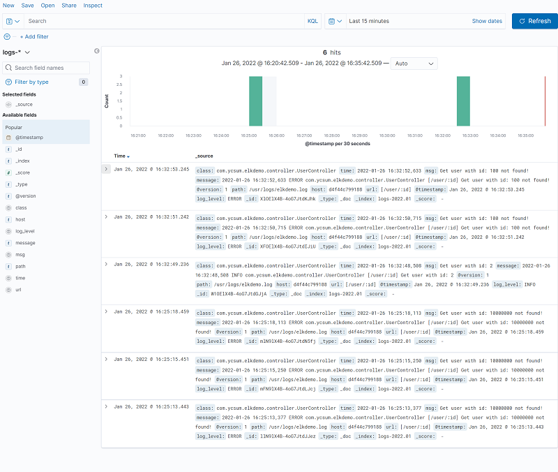
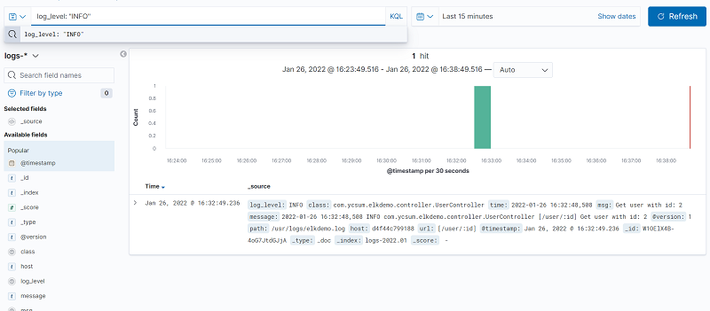

# ELK-DEMO
Trying out implementing ELK to commit log from spring boot to kibana

# Concept
1. Spring boot application will store logs in a file
2. Logstash will look at the file and push new logs to elastic search

## Logstash configuration
- Logstash's configuration is in `pipeline` folder
- The log file folder may need to be changed in the `-volume` part in the `docker-compose.yml` file

# Setup
1. Configure the `src/main/resource/logback.xml` to store log file in desired location
2. In `docker-compose.yml`, the log file directory location are required to be configured
3. Run `docker-compose up` to start the application

# Starting Kibana
- go to `http://localhost:5601` after starting up the docker compose file

# Result
- sample log:

  `2022-01-26 16:32:52,633 ERROR com.ycsum.elkdemo.controller.UserController [/user/:id] Get user with id: 100 not found!`
- sample output of logstash:

  you can see that the `message` is split into multiple fields such as: `url`, `log_level` and etc...
  ```
  {
      "_index": "logs-2022.01",
      "_type": "_doc",
      "_id": "XlOElX4B-4oG7JtdKJhk",
      "_version": 1,
      "_score": null,
      "_source": {
        "class": "com.ycsum.elkdemo.controller.UserController",
        "time": "2022-01-26 16:32:52,633",
        "msg": "Get user with id: 100 not found!\r",
        "message": "2022-01-26 16:32:52,633 ERROR com.ycsum.elkdemo.controller.UserController [/user/:id] Get user with id: 100 not found!\r",
        "@version": "1",
        "path": "/usr/logs/elkdemo.log",
        "host": "d4f44c799188",
        "url": "[/user/:id]",
        "@timestamp": "2022-01-26T08:32:53.245Z",
        "log_level": "ERROR"
      },
      "fields": {
        "@timestamp": [
          "2022-01-26T08:32:53.245Z"
        ]
      },
      "sort": [
        1643185973245
      ]
  }
    ```
  
- kibana dashboard
  - we can monitor all the server logs in kibana
  
  - we can perform flexible query to search for target log while debugging
 
